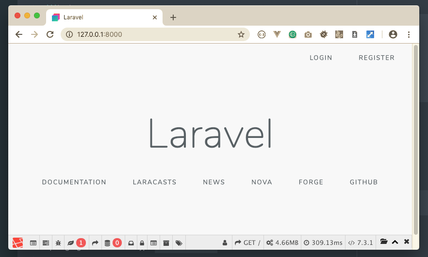

# Creating this project

## 1. Create using composer

```bash
$ composer create-project laravel/laravel laravel-crud-example --prefer-dist
```

## 2. Install NPM packages

```bash
$ cd laravel-crud-example
$ npm install
```

## 3. Install Composer Development Packages

```bash
$ composer require barryvdh/laravel-ide-helper barryvdh/laravel-debugbar laracasts/generators laracasts/utilities laracasts/testdummy --dev
```

## 4. Install Another Composer Packages (at least for my needs)

```bash
$ composer require laravelcollective/html laracasts/flash cviebrock/eloquent-sluggable cviebrock/eloquent-taggable
```

## 5. Configuring database connection

In order to configure your database in Laravel 5.7, Please open .env file. .env file is situated on laravel root folder.

Edit from this:

```dot
DB_CONNECTION=mysql
DB_HOST=127.0.0.1
DB_PORT=3306
DB_DATABASE=homestead
DB_USERNAME=homestead
DB_PASSWORD=secret
```

Into something like this:

```dot
DB_CONNECTION=mysql
DB_HOST=127.0.0.1
DB_PORT=3306
DB_DATABASE=laravel_crud_example
DB_USERNAME=root
DB_PASSWORD=root
```

## 6. Creating database

1. Open terminal and login to MySQL as the root user:

	```bash
	$ mysql -u root -p
	Enter password: |
	```

1. Type the MySQL root password, and then press Enter.
1. Create the database using this command in terminal:

	```sql
	mysql> CREATE DATABASE laravel_crud_example;
	```

So now you will be able to connect the **MySQL database**.

1. Type `\q` to exit the mysql program.

## 7. Laravel Authentication

Read the documentation [here](https://laravel.com/docs/5.7/authentication#introduction)

```bash
$ php artisan make:auth
```

## 8. Migration

**Laravel** always ships with migration files, so you can able to generate the tables in the database using the following command.

```bash
$ php artisan migrate
```

the output:

```bash
Migration table created successfully.
Migrating: 0000_00_00_000000_create_taggable_table
Migrated:  0000_00_00_000000_create_taggable_table
Migrating: 2014_10_12_000000_create_users_table
Migrated:  2014_10_12_000000_create_users_table
Migrating: 2014_10_12_100000_create_password_resets_table
Migrated:  2014_10_12_100000_create_password_resets_table
```

Check the database using sequel pro or MysqlWorkBench.


## 9. See it in the browser

```bash
$ php artisan serve
Laravel development server started: <http://127.0.0.1:8000>
```

Open google Chrome and type `127.0.0.1:8000`



noted that there is a tool bar in the bottom? It's for debugging purpose only. Remember we installed it at the beginning? Thanks to [Barry](https://packagist.org/users/barryvdh/). See it on [packagist](https://packagist.org/packages/barryvdh/laravel-debugbar) or [github](https://github.com/barryvdh/laravel-debugbar)

## (Optional) Bower Setup for the project

Open terminal and go to project root.

```bash
$ cd ~/Sites/laravel-crud-example
$ bower init
```

and follow the instruction, in my case:

    ? name (laravel-crud-example) <- just push return key on keyboard
    ? description Laravel CRUD Example
    ? main file <- just push return key on keyboard
    ? keywords laravel, crud, example, 5.7, tutorial
    ? authors (Aston Dihor <aston.dihor@yahoo.com>) <- just push return key on keyboard
    ? license (MIT) <- just push return key on keyboard
    ? homepage https://animousconsulting.com
    ? set currently installed components as dependencies? (Y/n) y
    ? add commonly ignored files to ignore list? (Y/n) y
    ? would you like to mark this package as private which prevents it from being accidentally published to the registry? (y/N) y
    ? Looks good? (Y/n) y

Install 

```bash
$ bower install --save
```


