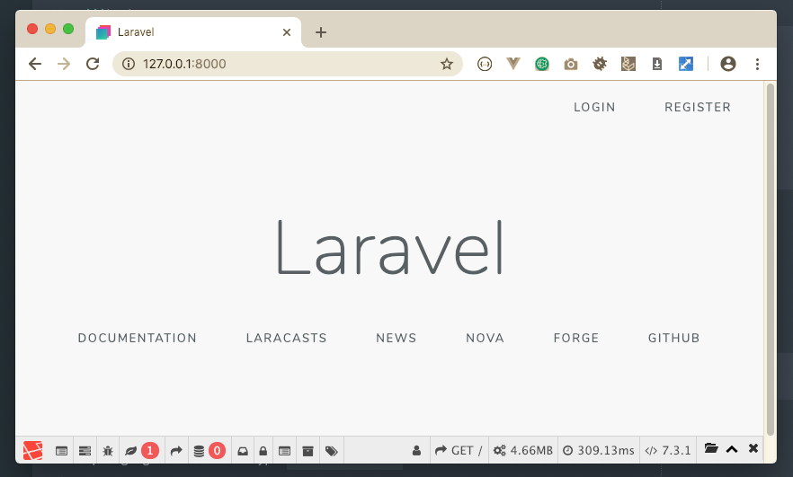
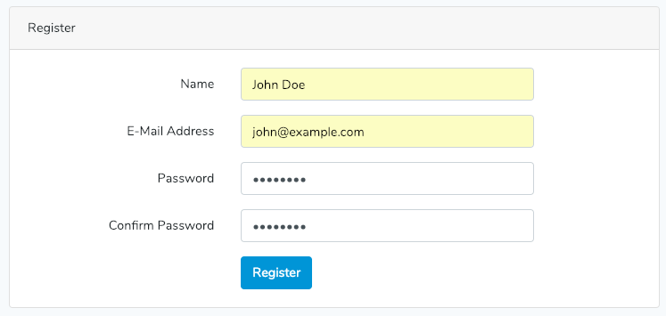
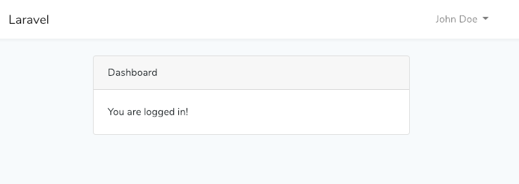
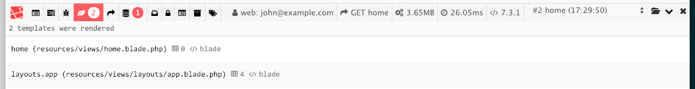
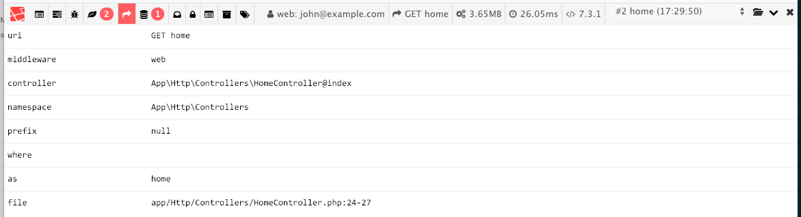

# CRUD on users table

## 1. Register an account to our web app

```bash
~/Sites/laravel-crud-example $ php artisan serve
Laravel development server started: <http://127.0.0.1:8000>
```

open google chrome and goto `http://127.0.0.1:8000`



Press `Register` button and fill up the form

	Name: John Doe
	E-Mail Address: john@example.com
	Password: password
	Confirm Password: password



And you are redirected to `http://127.0.0.1:8000/home` page. 



Open Barryvdh Laravel Debugbar on Chrome and see for your self the information:

Ther are 2 views rendered for the home page:

1. `resouces/views/home.blade.php`
1. `resouces/views/app.blade.php` <- layout file



> **Please remember** that when we create authentication preparation by typing `php artisan make:auth` command, laravel create view file in `resouces/views/` with the name of `home.blade.php` as the page that only can be access if you are authenticated. 
> 
> You can change this to `dashboard.blade.php` if you like. But never forget to change several things like route and redirect to `/dashboard` when authenticated.

Go open "Route" tab on laravel debugbar panel.



You can find some usefull information there, for example if you wonder what the controller being called, what method?

Please check another tabs like "Queries", "Auth", "Session" and "Request". OMG! It's help me a lot.

## Create CRUD Route

Okay, "kembali ke laptop".

Open chrome and type `http://127.0.0.1:8000/admin/users` and you will find that we are redirected to 404 page.

In order to have some CRUD functionality, we need routes to take us there. Open `routes/web.php` file and add these lines:

```php
Route::group(['prefix' => 'admin', 'namespace' => 'Admin', 'middleware' => 'auth'], function () {
    Route::delete('users/{id}', 'UsersController@destroy')->name('admin.users.destroy');
    Route::patch('users/{id}', 'UsersController@update')->name('admin.users.update');
    Route::get('users/{id}/edit', 'UsersController@edit')->name('admin.users.edit');
    Route::post('users', 'UsersController@store')->name('admin.users.store');
    Route::get('users/create', 'UsersController@create')->name('admin.users.create');
    Route::get('users/{id}', 'UsersController@show')->name('admin.users.show');
    Route::get('users', 'UsersController@index')->name('admin.users.index');
});
```

Open chrome and type `http://127.0.0.1:8000/admin/users` and you will find there is an error said that we do not have the controller, so let's make it quickly.

## Create The Controller

Open terminal and run this command.

```bash
$ php artisan make:controller Admin/UsersController --resource
```
The `--resource` parameter helps us to automatically creating CRUD methods.

Open that controller `app/Http/Controllers/Admin/UsersController.php`. And see what have been generated by artisan command.

```php
<?php

namespace App\Http\Controllers\Admin;

use Illuminate\Http\Request;
use App\Http\Controllers\Controller;

class UsersController extends Controller
{
    /**
     * Display a listing of the resource.
     *
     * @return \Illuminate\Http\Response
     */
    public function index()
    {
        //
    }

    /**
     * Show the form for creating a new resource.
     *
     * @return \Illuminate\Http\Response
     */
    public function create()
    {
        //
    }

    /**
     * Store a newly created resource in storage.
     *
     * @param  \Illuminate\Http\Request  $request
     * @return \Illuminate\Http\Response
     */
    public function store(Request $request)
    {
        //
    }

    /**
     * Display the specified resource.
     *
     * @param  int  $id
     * @return \Illuminate\Http\Response
     */
    public function show($id)
    {
        //
    }

    /**
     * Show the form for editing the specified resource.
     *
     * @param  int  $id
     * @return \Illuminate\Http\Response
     */
    public function edit($id)
    {
        //
    }

    /**
     * Update the specified resource in storage.
     *
     * @param  \Illuminate\Http\Request  $request
     * @param  int  $id
     * @return \Illuminate\Http\Response
     */
    public function update(Request $request, $id)
    {
        //
    }

    /**
     * Remove the specified resource from storage.
     *
     * @param  int  $id
     * @return \Illuminate\Http\Response
     */
    public function destroy($id)
    {
        //
    }
}
```

## Edit the layout

In order to use an icon, bootstrap 4 need to use additional icon, just to make our live is easy, we can pick font-awesome, or ionicons. Open layout file in `resources/views/layouts/app.blade.php` and edit like so:

Add Font-Awesome v5.6.3, edit Nunito, and create inline styles (we will have to move this style to app.css later, but for the purpose of this learning, it's okay for now)

```php
	<!-- Fonts -->
    <link rel="dns-prefetch" href="//fonts.gstatic.com">
    <link href="https://fonts.googleapis.com/css?family=Nunito:200,200i,400,400i,700,700i,900,900i" rel="stylesheet">
    <link rel="stylesheet" href="https://use.fontawesome.com/releases/v5.6.3/css/all.css" integrity="sha384-UHRtZLI+pbxtHCWp1t77Bi1L4ZtiqrqD80Kn4Z8NTSRyMA2Fd33n5dQ8lWUE00s/" crossorigin="anonymous">

    <!-- Styles -->
    @stack('style-before')
    <link href="{{ asset('css/app.css') }}" rel="stylesheet">
    @stack('style-after')

    <style>
    h1, .h1, h2, .h2, h3, .h3, h4, .h4, h5, .h5 {
        font-weight: 700;
    }

    .page-header h1 {
        font-size: 24px;
    }

    .page-header h1 small {
        color: #b7b7b7;
        font-weight: 200;
    }

    .table-nonfluid {
        width: auto !important;
    }
    </style>
```

Add laracasts flash before `@yield('content')`

```php
		<main class="py-4">
            <div class="container">
                @include('flash::message')
            </div>

            @yield('content')
        </main>
```


Move script tag from header to the bottom, just before the closing body tag. Don't forget to delete de "defer" attribute. And optional, we can add `@stack` before and after for later needs.

```php
    <!-- Scripts -->
    @stck('scripts-before')
    <script src="{{ asset('js/app.js') }}"></script>
    <script>
    $('#flash-overlay-modal').modal();
    </script>
    @stck('scripts-after')
</body>
</html>
```

## Create The Views

We need 5 view files:

1. index.blade.php
1. show.blade.php
1. create.blade.php
1. edit.blade.php
1. fields.blade.php

let create the folder first:

```bash
$ mkdir resources/views/admin
$ mkdir resources/views/admin/users
```

and then we are going to use VIM to create `index.blade.php`. Why VIM? Because I'm such a badass. ;P

### Create index.blade.php

```bash
$ vi resources/views/admin/users/index.blade.php
```

And edit like bellow:

`resources/views/admin/users/index.blade.php`

```php
@extends('layouts.app')

@section('content')
    <div class="container">
        <div class="row">
            <div class="col-md-12">
                <div class="page-header d-flex flex-row justify-content-between align-items-center">
                    <h1>Manage User
                        <small>Preview all users</small>
                    </h1>
                    <a href="{{ route('admin.users.create') }}" role="button" class="btn btn-success btn-sm"><i
                                class="fas fa-plus"></i> Add New User</a>
                </div>
                <div class="table-responsive">
                    <table class="table table-sm table-hover table-stripped table-bordered">
                        <thead>
                        <tr>
                            <th width="1%">ID</th>
                            <th>Name</th>
                            <th>Email</th>
                            <th>Created</th>
                            <th>Verified</th>
                            <th width="1%">Actions</th>
                        </tr>
                        </thead>
                        <tbody>
                        @foreach ($users as $user)
                            <tr>
                                <td class="text-right">{{ $user->id }}</td>
                                <td>{{ $user->name }}</td>
                                <td>{{ $user->email }}</td>
                                <td>{{ $user->created_at }}</td>
                                <td>
                                    @if ($user->email_verified_at)
                                        {{ $user->email_verified_at }}
                                    @else
                                        <div class="text-center">
                                            <i class="fas fa-times text-danger"></i>
                                        </div>
                                    @endif
                                </td>
                                <td>
                                    <div class="d-flex flex-row align-items-center">
                                        <a href="{{ route('admin.users.show', $user) }}" class="text-success mr-2"><i
                                                    class="far fa-eye"></i></a>
                                        <a href="{{ route('admin.users.edit', $user) }}" class="text-primary mr-2"><i
                                                    class="fas fa-pencil-alt"></i></a>
                                        <a href="#" data-href="{{ route('admin.users.destroy', $user) }}"
                                           class="delete-button text-danger"><i class="fas fa-trash"></i></a>
                                    </div>
                                </td>
                            </tr>
                        @endforeach
                        </tbody>
                    </table>
                </div>
            </div>
        </div>
    </div>
@endsection

@push('scripts-after')
    <script>
        const swalWithBootstrapButtons = Swal.mixin({
            confirmButtonClass: 'btn btn-success',
            cancelButtonClass: 'btn btn-danger',
            buttonsStyling: false,
        });
        $('.delete-button').click(function (e) {
            e.preventDefault();
            var url = $(this).attr('data-href');
            swalWithBootstrapButtons.fire({
                title: 'Are you sure?',
                text: "You won't be able to revert this!",
                type: 'warning',
                showCancelButton: true,
                confirmButtonColor: '#3085d6',
                confirmButtonText: 'Yes, delete it!'
            }).then((result) => {
                if (result.value) {
                    $.ajax({
                        method: 'POST',
                        url: url,
                        data: {
                            // 'id': id,
                            '_token': '{{ csrf_token() }}',
                            '_method': 'DELETE'
                        },
                        success: function () {
                            swalWithBootstrapButtons.fire(
                                'Deleted!',
                                'Your user record has been deleted.',
                                'success'
                            ).then((result) => {
                                location.reload();
                            });
                        },
                        error: function (jqXHR, textStatus, errorThrown) {
                            alert(jqXHR.status);
                            alert(textStatus);
                            alert(errorThrown);
                        }
                    });
                } else if (result.dismiss === Swal.DismissReason.cancel) {
                    swalWithBootstrapButtons.fire(
                        'Cancelled',
                        'Your user record is safe :)',
                        'error'
                    );
                }
            });
        });
    </script>
@endpush

```

Then edit the controller:

add User Model to the 'use' section:

```php
use App\User;
```

edit the index method:

```php
    public function index()
    {
        $users = User::all();

        return view('admin.users.index', compact('users'));
    }
```

refresh the chrome page of `http://127.0.0.1:8000/admin/users`. Some cosmetic can be added further more, but for now, for the purpose of this lesson, we have what we expected.

### Create `create.blade.php` file

```bash
$ vi resources/views/admin/users/create.blade.php
```

And edit like bellow:

`resources/views/admin/users/create.blade.php`

```php
@extends('layouts.app')

@section('content')
    <div class="container">
        <div class="page-header d-flex flex-row align-items-center justify-content-between">
            <h1>New User
                <small>Create a new user record</small>
            </h1>
            <a href="{{ route('admin.users.index') }}"><i class="fas fa-chevron-left"></i> Back to list</a>
        </div>
        <div class="row my-5">
            <div class="col-12 col-sm-8 col-md-6 offset-md-3">
                <div class="card">
                    <div class="card-header">
                        <h3 class="mb-0 h4">User Form</h3>
                    </div>
                    <div class="card-body">
                        @if ($errors->any())
                            <div class="alert alert-danger">
                                <ul class="mb-0">
                                    @foreach ($errors->all() as $error)
                                        <li>{{ $error }}</li>
                                    @endforeach
                                </ul>
                            </div>
                        @endif
                        {!! Form::open(['method' => 'POST', 'route' => 'admin.users.store']) !!}
                        @include('admin.users.fields')
                        {!! Form::close() !!}
                    </div>
                </div>
            </div>
        </div>
    </div>
@endsection

```

And create fields.blade.php file

### Create `fields.blade.php` file

`resources/views/admin/users/fields.blade.php`

```php
<div class="form-group">
    <label for="name">Name:</label>
    {!! Form::text('name', null, ['class' => 'form-control', 'autofocus' => 'autofocus', 'placeholder' => 'Enter your full name']) !!}
</div>
<div class="form-group">
    <label for="email">Email:</label>
    {!! Form::email('email', null, ['class' => 'form-control', 'placeholder' => 'Your E-Mail address']) !!}
</div>
<div class="form-group">
    <label for="password">Password:</label>
    {!! Form::password('password', ['class' => 'form-control', 'placeholder' => 'password']) !!}
</div>
<div class="form-group">
    <label for="password_confirmation">Confirm Password:</label>
    {!! Form::password('password_confirmation', ['class' => 'form-control', 'placeholder' => 'Retype the password']) !!}
</div>

{!! Form::button('<i class="fas fa-save"></i> Submit', ['type' => 'submit', 'class' => 'btn btn-primary']) !!}
{!! Form::button('<i class="fas fa-redo-alt"></i> Reset', ['type' => 'reset', 'class' => 'btn btn-secondary']) !!}
<a href="{{ route('admin.users.index') }}" class="btn btn-secondary" role="button"><i class="fas fa-times"></i>
    Cancel</a>
```

Then edit the controller:

```php
 	/**
     * Store a newly created resource in storage.
     *
     * @param  \Illuminate\Http\Request  $request
     * @return \Illuminate\Http\Response
     */
    public function store(Request $request)
    {
        $request->validate([
            'name'=>'required|min:3|max:255',
            'email'=> 'required|email|min:7|max:255|unique:users,email',
            'password' => 'required|confirmed',
        ]);

        User::create([
            'name' => $request->name,
            'email' => $request->email,
            'password' => bcrypt($request->password)
        ]);

        flash('User successfully created!');
        return redirect()->back();
    }

```

### Create `edit.blade.php` file

`resources/views/admin/users/edit.blade.php`

```php
@extends('layouts.app')

@section('content')
    <div class="container">
        <div class="page-header d-flex flex-row align-items-center justify-content-between">
            <h1>New User
                <small>Create a new user record</small>
            </h1>
            <a href="{{ route('admin.users.index') }}"><i class="fas fa-chevron-left"></i> Back to list</a>
        </div>

        <div class="row my-5">
            <div class="col-12 col-sm-8 col-md-6 offset-md-3">
                <div>
                    <div class="card">
                        <div class="card-header">
                            <h3 class="mb-0 h4">User Form</h3>
                        </div>
                        <div class="card-body">
                            @if ($errors->any())
                                <div class="alert alert-danger">
                                    <ul class="mb-0">
                                        @foreach ($errors->all() as $error)
                                            <li>{{ $error }}</li>
                                        @endforeach
                                    </ul>
                                </div>
                            @endif
                            {!! Form::model($user, ['method' => 'PATCH', 'route' => ['admin.users.update', $user->id]]) !!}
                            @include('admin.users.fields')
                            {!! Form::close() !!}
                        </div>
                    </div>
                </div>
            </div>
        </div>
    </div>
@endsection
```

And edit the controller:

```php
	/**
     * Show the form for editing the specified resource.
     *
     * @param  int  $id
     * @return \Illuminate\Http\Response
     */
    public function edit($id)
    {
        $user = User::findOrFail($id);

        return view('admin.users.edit', compact('user'));
    }

    /**
     * Update the specified resource in storage.
     *
     * @param  \Illuminate\Http\Request  $request
     * @param  int  $id
     * @return \Illuminate\Http\Response
     */
    public function update(Request $request, $id)
    {
        $user = User::findOrFail($id);

        if ($request->password) {
            $request->validate([
                'name'=>'required|min:3|max:255',
                'email'=> 'required|email|min:7|max:255|unique:users,email,'.$user->id,
                'password' => 'required|confirmed',
            ]);

            $user->password = bcrypt($request->password);

        } else {
            $request->validate([
                'name'=>'required|min:3|max:255',
                'email'=> 'required|email|min:7|max:255|unique:users,email,'.$user->id
            ]);
        }

        $user->name = $request->name;
        $user->email = $request->email;
        $user->save();

        flash('User successfully updated!');

        return redirect()->back();
    }
```

### Create `show.blade.php` file

`resources/views/admin/users/show.blade.php`

```php
@extends('layouts.app')

@section('content')
    <div class="container">
        <div class="page-header d-flex flex-row align-items-center justify-content-between">
            <h1>Show User
                <small>{{ $user->name }}</small>
            </h1>
            <a href="{{ route('admin.users.index') }}"><i class="fas fa-chevron-left"></i> Back to list</a>
        </div>
        <div class="row">
            <div class="col-12">
                <table class="my-4 table table-sm table-nonfluid table-bordered">
                    <tr>
                        <td>ID</td>
                        <th>{{ $user->id }}</th>
                    </tr>
                    <tr>
                        <td>Name</td>
                        <th>{{ $user->name }}</th>
                    </tr>
                    <tr>
                        <td>Email</td>
                        <th>{{ $user->email }}</th>
                    </tr>
                    <tr>
                        <td>Created At</td>
                        <th>{{ $user->created_at }}</th>
                    </tr>
                    <tr>
                        <td>Updated At</td>
                        <th>{{ $user->updated_at }}</th>
                    </tr>
                    <tr>
                        <td>Verified</td>
                        <th>
                            @if ($user->email_verified_at)
                                {{ $user->email_verified_at }}
                            @else
                                <i class="fas fa-times text-danger"></i>
                            @endif
                        </th>
                    </tr>
                </table>

                <a href="{{ route('admin.users.edit', $user) }}"><i class="fas fa-pencil-alt"></i> Edit this user</a>
            </div>
        </div>
    </div>
@endsection
```

And edit the controller:

```php
	/**
     * Display the specified resource.
     *
     * @param  int  $id
     * @return \Illuminate\Http\Response
     */
    public function show($id)
    {
        $user = User::findOrFail($id);

        return view('admin.users.show', compact('user'));
    }
```


### Install SweetAlert2

Download the files from : [https://www.jsdelivr.com/package/npm/sweetalert2](https://www.jsdelivr.com/package/npm/sweetalert2)

Unzip sweetalert2-8.0.1.tgz file and copy this file into `public/assets/sweetalert2` folder.

```bash
$ cd ~/Sites/laravel-crud-example
$ mkdir public/assets
$ mkdir public/assets/sweetalert2
$ cp ~/Downloads/package/dist/sweetalert2.all.min.js ./public/assets/sweetalert2/
$ cp ~/Downloads/package/dist/sweetalert2.min.css ./public/assets/sweetalert2/
```

Edit layouts file (`resources/views/layouts/app.blade.php`) and add link to css file below `css/app.css` link tag

```php
    @stack('style-before')
    <link href="{{ asset('css/app.css') }}" rel="stylesheet">
    <link href="{{ asset('assets/sweetaler2/sweetalert2.min.css') }}" rel="stylesheet">
    @stack('style-after')
```

Add js file bellow `js/app.js` script tag

```php
    <!-- Scripts -->
    @stack('scripts-before')
    <script src="{{ asset('js/app.js') }}"></script>
    <script src="{{ asset('assets/sweetalert2/sweetalert2.all.min.js') }}"></script>
    <script>
    $('#flash-overlay-modal').modal();
    </script>
    @stack('scripts-after')
</body>
</html>
```

### Edit destroy method on controller

```php
	/**
     * Remove the specified resource from storage.
     *
     * @param  int  $id
     * @return \Illuminate\Http\Response
     */
    public function destroy(Request $request, $id)
    {
        $user = User::findOrFail($id);

        $user->delete();

        flash('User has been deleted Successfully');

        if ($request->ajax()){
            return response()->json('success', 200);
        }

        return redirect()->back();
    }
```

## The complete code of Users controller

`app/Http/Controllers/Admin/UsersController.php`


```php
<?php

namespace App\Http\Controllers\Admin;

use Illuminate\Http\Request;
use App\Http\Controllers\Controller;
use App\User;

class UsersController extends Controller
{
    /**
     * Display a listing of the resource.
     *
     * @return \Illuminate\Http\Response
     */
    public function index()
    {
        $users = User::all();

        return view('admin.users.index', compact('users'));
    }

    /**
     * Show the form for creating a new resource.
     *
     * @return \Illuminate\Http\Response
     */
    public function create()
    {
        return view('admin.users.create');
    }

    /**
     * Store a newly created resource in storage.
     *
     * @param  \Illuminate\Http\Request  $request
     * @return \Illuminate\Http\Response
     */
    public function store(Request $request)
    {
        $request->validate([
            'name'=>'required|min:3|max:255',
            'email'=> 'required|email|min:7|max:255|unique:users,email',
            'password' => 'required|confirmed',
        ]);

        User::create([
            'name' => $request->name,
            'email' => $request->email,
            'password' => bcrypt($request->password)
        ]);

        flash('User successfully created!');
        return redirect()->back();
    }

    /**
     * Display the specified resource.
     *
     * @param  int  $id
     * @return \Illuminate\Http\Response
     */
    public function show($id)
    {
        $user = User::findOrFail($id);

        return view('admin.users.show', compact('user'));
    }

    /**
     * Show the form for editing the specified resource.
     *
     * @param  int  $id
     * @return \Illuminate\Http\Response
     */
    public function edit($id)
    {
        $user = User::findOrFail($id);

        return view('admin.users.edit', compact('user'));
    }

    /**
     * Update the specified resource in storage.
     *
     * @param  \Illuminate\Http\Request  $request
     * @param  int  $id
     * @return \Illuminate\Http\Response
     */
    public function update(Request $request, $id)
    {
        $user = User::findOrFail($id);

        if ($request->password) {
            $request->validate([
                'name'=>'required|min:3|max:255',
                'email'=> 'required|email|min:7|max:255|unique:users,email,'.$user->id,
                'password' => 'required|confirmed',
            ]);

            $user->password = bcrypt($request->password);

        } else {
            $request->validate([
                'name'=>'required|min:3|max:255',
                'email'=> 'required|email|min:7|max:255|unique:users,email,'.$user->id
            ]);
        }

        $user->name = $request->name;
        $user->email = $request->email;
        $user->save();

        flash('User successfully updated!');

        return redirect()->back();
    }

    /**
     * Remove the specified resource from storage.
     *
     * @param  int  $id
     * @return \Illuminate\Http\Response
     */
    public function destroy(Request $request, $id)
    {
        $user = User::findOrFail($id);

        $user->delete();

        flash('User has been deleted Successfully');

        if ($request->ajax()){
            return response()->json('success', 200);
        }

        return redirect()->back();
    }
}
```

## The complete code of layout

`resources/views/layouts/app.blade.php`


```php
<!DOCTYPE html>
<html lang="{{ str_replace('_', '-', app()->getLocale()) }}">
<head>
    <meta charset="utf-8">
    <meta name="viewport" content="width=device-width, initial-scale=1">

    <!-- CSRF Token -->
    <meta name="csrf-token" content="{{ csrf_token() }}">

    <title>{{ config('app.name', 'Laravel') }}</title>

    <!-- Fonts -->
    <link rel="dns-prefetch" href="//fonts.gstatic.com">
    <link href="https://fonts.googleapis.com/css?family=Nunito:200,200i,400,400i,700,700i,900,900i" rel="stylesheet">
    <link rel="stylesheet" href="https://use.fontawesome.com/releases/v5.6.3/css/all.css" integrity="sha384-UHRtZLI+pbxtHCWp1t77Bi1L4ZtiqrqD80Kn4Z8NTSRyMA2Fd33n5dQ8lWUE00s/" crossorigin="anonymous">

    <!-- Styles -->
    @stack('style-before')
    <link href="{{ asset('css/app.css') }}" rel="stylesheet">
    <link href="{{ asset('assets/sweetalert2/sweetalert2.min.css') }}" rel="stylesheet">
    @stack('style-after')

    <style>
    h1, .h1, h2, .h2, h3, .h3, h4, .h4, h5, .h5 {
        font-weight: 700;
    }

    .page-header h1 {
        font-size: 24px;
    }

    .page-header h1 small {
        color: #b7b7b7;
        font-weight: 200;
    }

    .table-nonfluid {
        width: auto !important;
    }

    .swal2-actions .swal2-confirm {
        margin-right: 5px;
    }
    </style>

</head>
<body>
    <div id="app">
        <nav class="navbar navbar-expand-md navbar-light navbar-laravel">
            <div class="container">
                <a class="navbar-brand" href="{{ url('/') }}">
                    {{ config('app.name', 'Laravel') }}
                </a>
                <button class="navbar-toggler" type="button" data-toggle="collapse" data-target="#navbarSupportedContent" aria-controls="navbarSupportedContent" aria-expanded="false" aria-label="{{ __('Toggle navigation') }}">
                    <span class="navbar-toggler-icon"></span>
                </button>

                <div class="collapse navbar-collapse" id="navbarSupportedContent">
                    <!-- Left Side Of Navbar -->
                    <ul class="navbar-nav mr-auto">

                    </ul>

                    <!-- Right Side Of Navbar -->
                    <ul class="navbar-nav ml-auto">
                        <!-- Authentication Links -->
                        @guest
                            <li class="nav-item">
                                <a class="nav-link" href="{{ route('login') }}">{{ __('Login') }}</a>
                            </li>
                            @if (Route::has('register'))
                                <li class="nav-item">
                                    <a class="nav-link" href="{{ route('register') }}">{{ __('Register') }}</a>
                                </li>
                            @endif
                        @else
                            <li class="nav-item dropdown">
                                <a id="navbarDropdown" class="nav-link dropdown-toggle" href="#" role="button" data-toggle="dropdown" aria-haspopup="true" aria-expanded="false" v-pre>
                                    {{ Auth::user()->name }} <span class="caret"></span>
                                </a>

                                <div class="dropdown-menu dropdown-menu-right" aria-labelledby="navbarDropdown">
                                    <a class="dropdown-item" href="{{ route('logout') }}"
                                       onclick="event.preventDefault();
                                                     document.getElementById('logout-form').submit();">
                                        {{ __('Logout') }}
                                    </a>

                                    <form id="logout-form" action="{{ route('logout') }}" method="POST" style="display: none;">
                                        @csrf
                                    </form>
                                </div>
                            </li>
                        @endguest
                    </ul>
                </div>
            </div>
        </nav>

        <main class="py-4">
            <div class="container">
                @include('flash::message')
            </div>

            @yield('content')
        </main>
    </div>

    <!-- Scripts -->
    @stack('scripts-before')

    <script src="{{ asset('js/app.js') }}"></script>
    <script src="{{ asset('assets/sweetalert2/sweetalert2.all.min.js') }}"></script>
    <!-- Optional: include a polyfill for ES6 Promises for IE11 and Android browser -->
    {{-- <script src="https://cdn.jsdelivr.net/npm/promise-polyfill"></script> --}}
    <script>
    $('#flash-overlay-modal').modal();
    </script>
    @stack('scripts-after')
</body>
</html>
```

---

The repository can be access in [here](https://github.com/astondihor/laravel-crud-example)